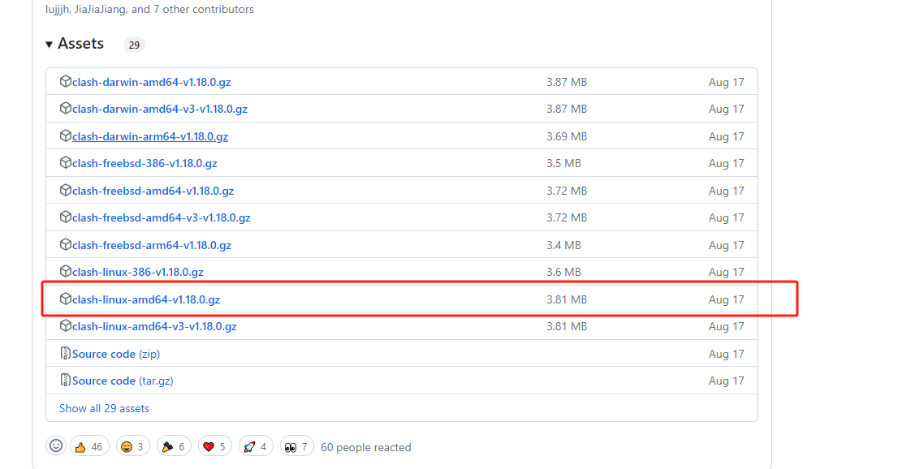
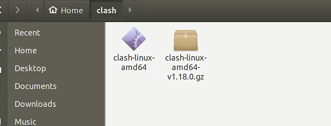
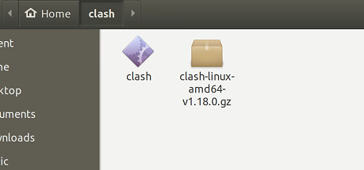
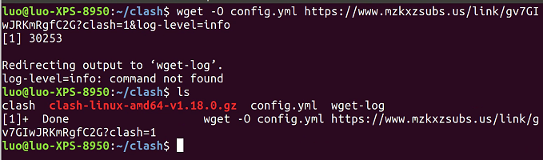
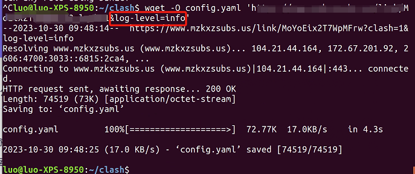
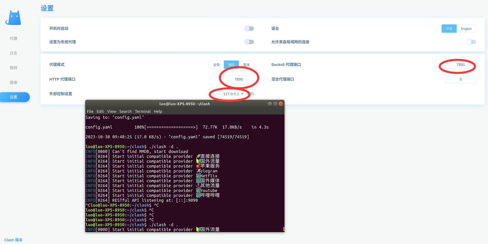
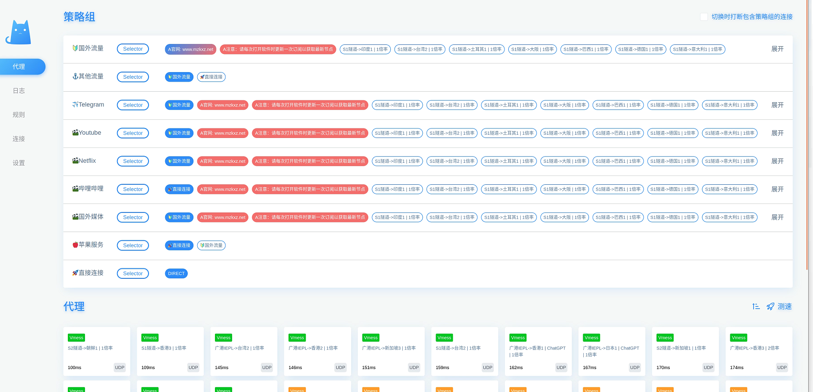
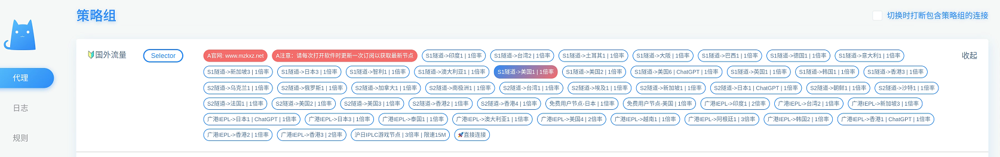
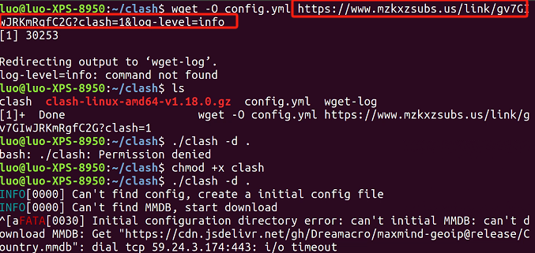
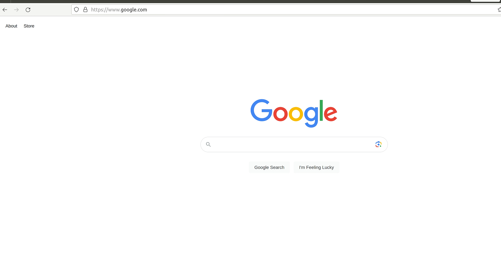

# Ubuntu clash配置

参考教程
- [Clash使用教程](https://fly.catcottage.us/user/help/view/5/13)
- [[SSR/Trojan][通用版客户端]在 Linux下通过 Clash 连接](https://iyuantiao.com/fenxiangfuli/jiaocheng/ssr-trojan%E9%80%9A%E7%94%A8%E7%89%88%E5%AE%A2%E6%88%B7%E7%AB%AF%E5%9C%A8-linux%E4%B8%8B%E9%80%9A%E8%BF%87-clash-%E8%BF%9E%E6%8E%A5.html)
- [Linux(Centos7) 使用Clash For Linux网络代理工具教程](https://199604.com/2001)
- [Ubuntu-clash](https://qiyuan-z.github.io/2020/02/05/Ubuntu-clash%E9%85%8D%E7%BD%AE/)

## 1.下载安装包
执行 cd && mkdir clash 在用户目录下创建 clash 文件夹。

下载 Clash v1.8.0 或更早的版本 二进制文件并解压重命名为 clash

一般个人的64位电脑下载 clash-linux-amd64.tar.gz 即可。

[clash Releases](https://github.com/Dreamacro/clash/releases)




## 2.初始化配置
在终端 cd 到 Clash 二进制文件所在的目录，执行 wget -O config.yaml 'https://www.mzkxzsubs.us/link/gv7GIwJRKmRgfC2G?clash=1&log-level=info' 下载 Clash 配置文件



这里有问题，这里需要换成你自己的clash订阅链接（链接放在单引号中，注意后面有```&log-level=info```）。重新配置一遍。



## 3.加载配置
执行```./clash -d . ```即可启动 Clash，同时启动 HTTP 代理和 Socks5 代理。

如提示权限不足，请执行 chmod +x clash



## 4.端口访问

访问 [Clash Dashboard](https://clash.razord.top/#/proxies) 可以进行切换节点、测延迟等操作。



选择一个节点



## 5.启动代理
以 Ubuntu 18.04 为例，打开系统设置，选择网络，点击网络代理右边的 ⚙ 按钮，选择手动，填写 HTTP 和 HTTPS 代理为 127.0.0.1:7890，填写 Socks 主机为 127.0.0.1:7891，即可启用系统代理。



开启科学上网...



如果关掉了终端，下次启动记得进入clash然后再终端输入```./clash -d . ```

github clone的速度似乎并不快... 不知道是不是因为本身网络的原因

